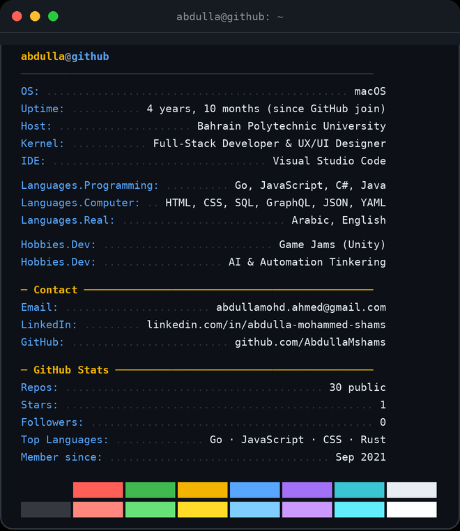
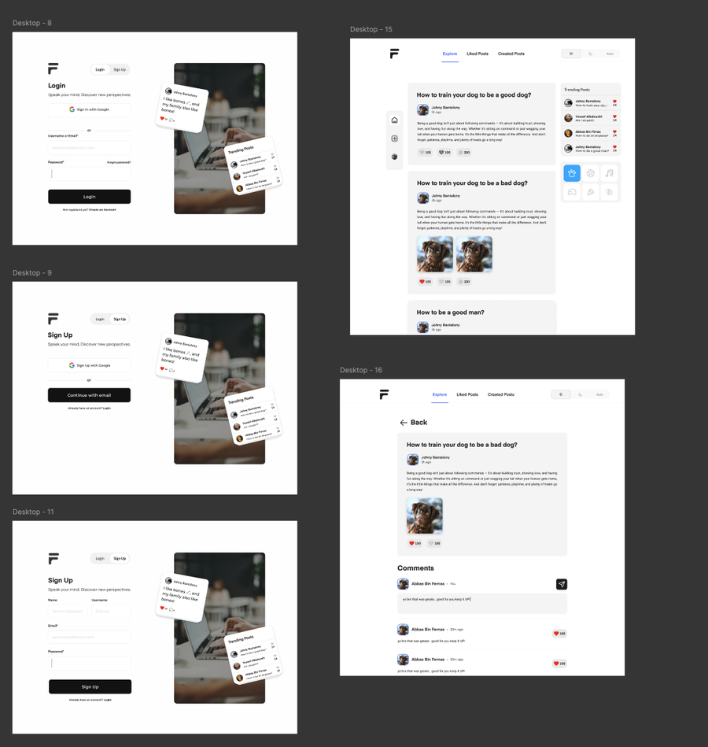
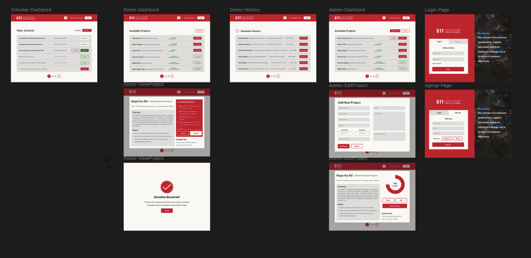
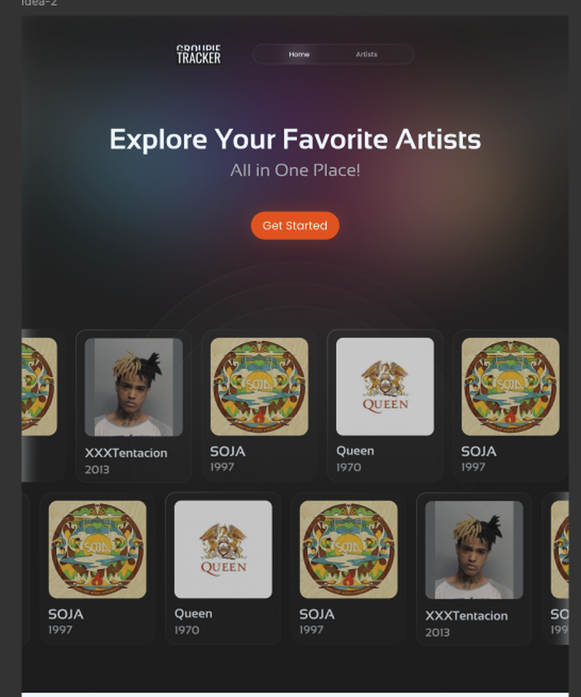
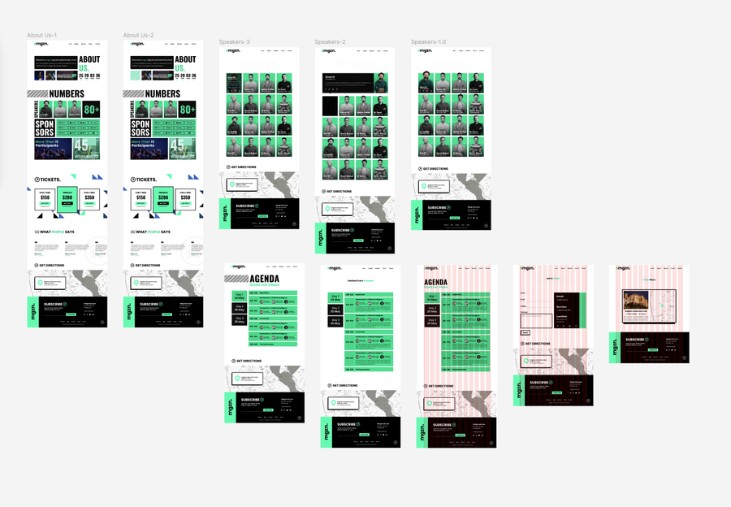
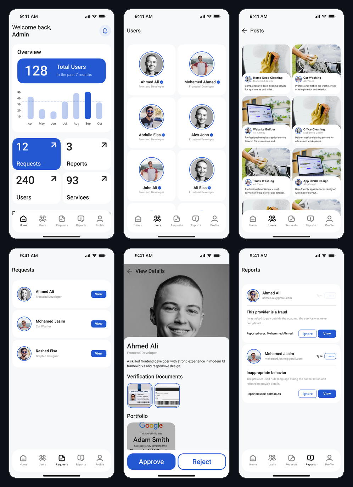
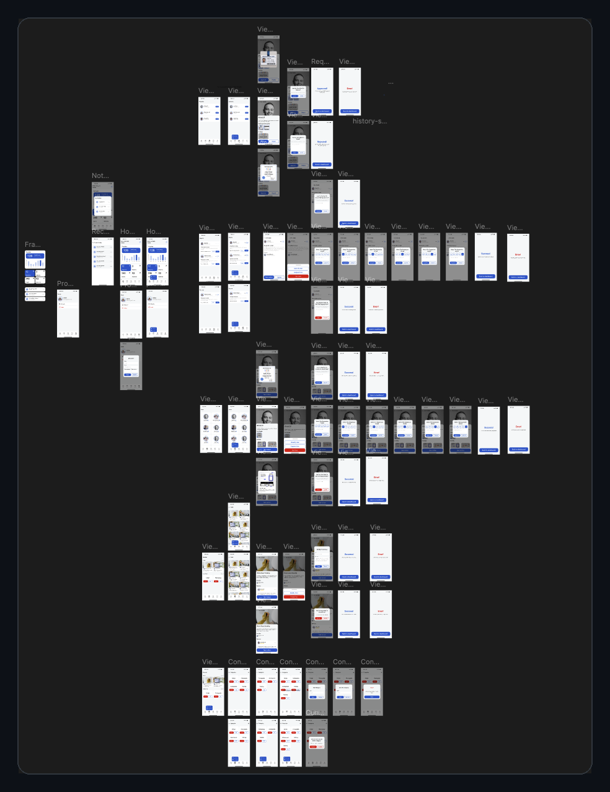

Full-stack developer building web apps, real-time systems, and RESTful APIs with Go, JavaScript, C# and React — with an eye for interface design.

 

<picture>
  <source media="(prefers-color-scheme: dark)" srcset="https://raw.githubusercontent.com/AbdullaMshams/AbdullaMshams/output/github-contribution-grid-snake-dark.svg">
  <source media="(prefers-color-scheme: light)" srcset="https://raw.githubusercontent.com/AbdullaMshams/AbdullaMshams/output/github-contribution-grid-snake.svg">
  
</picture>

 

 

### 🧰 Tech Stack

 

## 🎨 Design Work

Selected UI/UX projects designed in Figma. Full breakdown and more screens available on request.

<table>
<tr>
<td width="50%">

**Real-Time Forum**
 
Figma, Go, JavaScript · Reboot01 · Jul – Aug 2025
  
Built a real-time single-page forum from scratch in Go and JavaScript, with WebSocket-based private messaging, live online/offline presence, and throttled message pagination — designed in Figma first.

</td>
<td width="50%">

**Bahrain Trust Foundation**
 
Figma · University Group Project · Jan – May 2024
  
Designed the full UI for a 3-role charity platform (volunteer, donor, admin) covering task management, project browsing, and a donation flow.

</td>
</tr>
<tr>
<td width="50%">

**Groupie Tracker**
 
Figma, Go · Reboot01 · May – Jul 2025
  
Designed a landing page for browsing bands and tour dates in Figma, then built the Go backend consuming a REST API.

</td>
<td width="50%">

**mgzn. — Conference Landing Page**
 
Figma · Personal Practice Project · Nov 2023
  
Designed a multi-page landing site (About, Speakers, Agenda, Tickets) for a fictional tech conference.

</td>
</tr>
<tr>
<td width="50%">

**Dubrah — Admin Dashboard**
 
Swift · University Group Project
  
Designed and built the native iOS admin dashboard for Dubrah, a services marketplace app — managing users, verification requests (with document review and approve/reject), service reports, and platform analytics.

View full project board (full app flow, not just the dashboard)

 

</td>
<td width="50%">

</td>
</tr>
</table>

 

## 🚀 Projects

A few things I've built recently — a sample, not the full list:

<table>
<tr><th align="left">Project</th><th align="left">Stack</th><th align="left">Highlights</th></tr>
<tr>
<td valign="top"><b>Taalam</b> Feb – Jun 2026</td>
<td valign="top">ASP.NET Core · EF Core · JWT · Azure · SQL Server</td>
<td valign="top">Training &amp; certification platform. Auth &amp; role-based authorization across a 3-app ASP.NET Core 9 setup (cookie auth in MVC, JWT bearer in the API); built a decoupled reporting app consuming the API end-to-end via <code>HttpClient</code>, deployed to Azure App Service.</td>
</tr>
<tr>
<td valign="top"><b><a href="https://github.com/AbdullaMshams/CTRL-ESC">CTRL+ESC</a></b> Feb – Jun 2026</td>
<td valign="top">Unity · C# · OpenAI API</td>
<td valign="top">3D escape-room game. Led a 5-person Scrum team; built an AI-powered terminal puzzle with a persuadable NPC wired to OpenAI's chat completions API, prompt-engineered for a specific outcome and proxied through a Cloudflare Worker to keep the key off the client.</td>
</tr>
<tr>
<td valign="top"><b>Bomberman</b> Mar – Jun 2026</td>
<td valign="top">JavaScript (custom framework) · WebSockets · n8n · OpenAI API</td>
<td valign="top">2–4 player multiplayer browser game with no canvas/WebGL, rendered via <code>requestAnimationFrame</code> at a stable 60fps. Extended with an n8n pipeline that generates each player's pixel-art sprite from a selfie using OpenAI's image API, with background removal and cloud storage via remove.bg and Cloudinary.</td>
</tr>
<tr>
<td valign="top"><b><a href="https://github.com/AbdullaMshams/husaiali-social-network">Social Network Platform</a></b> Nov 2025 – Jan 2026</td>
<td valign="top">Go · React · SQLite · Docker · WebSockets</td>
<td valign="top">Facebook-style platform with groups, real-time chat, and notifications. Split across 2 Docker containers, secured with session-based auth and bcrypt password hashing.</td>
</tr>
<tr>
<td valign="top"><b><a href="https://github.com/AbdullaMshams/mini-framework">Custom JS Framework &amp; TodoMVC</a></b> Mar – Apr 2026</td>
<td valign="top">JavaScript · HTML · CSS</td>
<td valign="top">A JavaScript framework built from scratch — DOM abstraction, routing, state management, and custom events — with full developer docs.</td>
</tr>
<tr>
<td valign="top"><b>Admin Dashboard</b> Oct – Dec 2025</td>
<td valign="top">Figma · Swift · Storyboard</td>
<td valign="top">Designed a 6-screen admin dashboard in Figma (user management, verification, moderation) and implemented it natively in Swift/Storyboard.</td>
</tr>
</table>

 

## 🏆 Highlights

- 🚀 **Galactic Problem Solver** — NASA Space Apps Challenge, 2024 · built a climate-data visualization tool during a global hackathon.
- 🧑‍🤝‍🧑 Led small Scrum teams (up to 5 people) from concept to shipped product under tight deadlines.

 

### 📊 Live GitHub Stats

Pulled fresh from the GitHub API on every page load — not a snapshot.

  

 

Bachelor of ICT Programming, Bahrain Polytechnic University (2023–2027) · Full Stack Development Diploma, Reboot Coding Institute (2024–2026)
  

